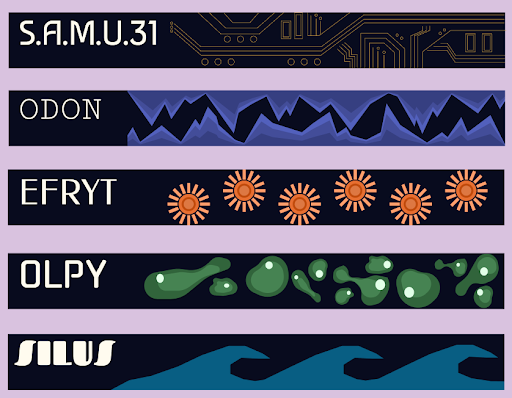
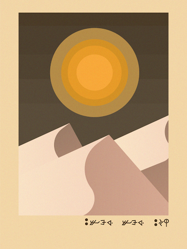
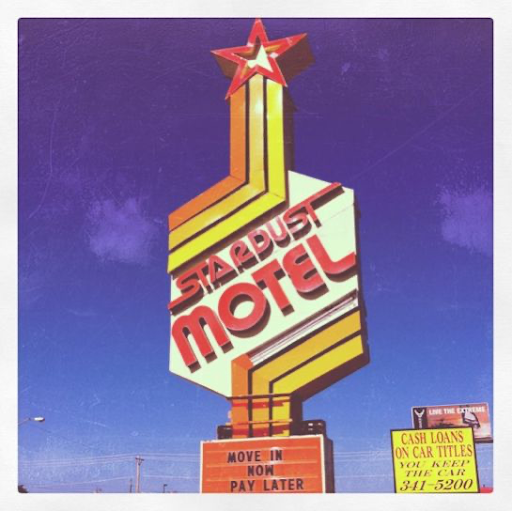
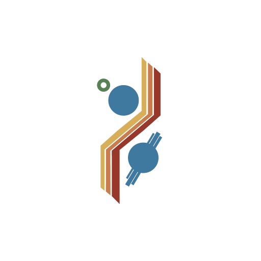

# JULY 22ND, 2024 - Design Insights

Hello all, I’m Charlotte! I’m a UI/UX designer here at Placebo Entertainment. Even though I was officially brought on for design work, I’m also a 2D artist and I’ve gotten to do a lot of illustration work as well here! From designing the website you’re reading right now to illustrating in-universe posters, I’ve been really happy getting to flex my skills as a designer and an artist through a lot of different projects. The most unique project I’ve worked on here is designing a faux alien language, converting it into a custom font and importing it into the game. You’ll be reading it soon enough, I’m sure. 

 &nbsp;  

One project I’ve just recently finished is designing the game logo and icon. We want to reveal the game logo with the announcement of our game, so you’ll just have to stay tuned for that design. I wanted it to look like a vintage, pulpy scifi book cover, and I think we delivered. As for the icon, I wanted it to look like a piece that had an in-universe meaning. I knew I wanted it to be the insignia of the crew’s ship. 

Before I start designing, I get inspiration. Since it was supposed to be a ship’s voyage, I got the idea for a ship’s insignia from old NASA patches. And since we’re really leaning into the midcentury/70s aesthetic for the game, I started there. I found a space-themed motel sign and thought “oh, perfect.”

 

Since the game is about the edge of the world as we know it, I wanted to incorporate a motif of division, with lines separating two worlds from each other. At the same time, there’s an overall sense of balance and wholeness despite the separation. I knew we had to have different icons for different parts of the game, but my favorite is the retro-colors found in this version. 

 

Moving on from icons, lately I’ve been fully devoted to illustration, making the opening and ending sequences for the game. But don’t worry, I’ll make sure not to spoil anything for you here. 

Hayden (who wrote in this blog earlier) has been really helpful in this process, making storyboards for me to follow. The opening scene was a little easier to storyboard, as you want to set up the adventure and already know where the adventure will lead. The endings were a little harder to nail down. 

I had a hand in shaping one of the endings, talking with the game designers, figuring out exactly how we’d portray a specific feeling of curiosity and transformation in the artwork and writing. 

After I was handed the storyboards, I drew out detailed scenes on paper. My truth is that for all the technology I deal with every day, the only way I can make digital art is by drawing it out first. I take those detailed drawings and import them into Adobe Illustrator, where I translate them into colorful shapes that make up the full picture. I also love adding grain texture on top for that vintage feeling. 

I consider myself very lucky to create the first and last images the players see in the game, to leave my own personal touch on such a collaborative project. We’ve been working hard, and I can’t wait for you to see what we’ve made. 

–Charlotte