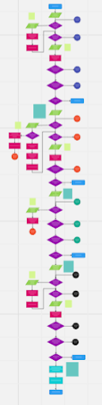
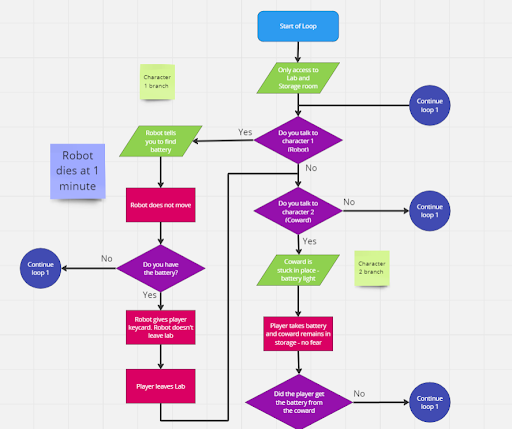
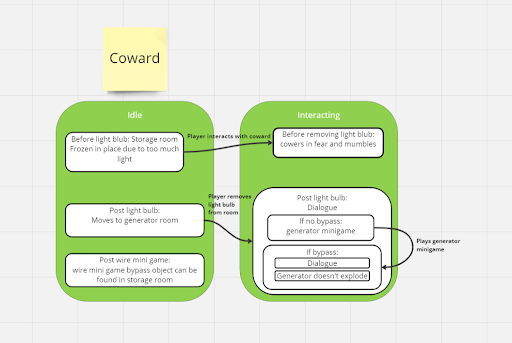

# JUNE 6TH, 2024 - First Playable!
And finally here is First Playable! Which is the perfect time to walk you guys through our game play flow chart!

A lot of the design work being done right now is in documentation. We have ideas we’re excited about, but those ideas are only as good as we’re able to communicate with the rest of our team. I find flowcharts to be really helpful at communicating the flow of games. One of the interesting things about designing a time loop game is figuring out what the game looks like the first time the player does the loop vs the second time vs the last time and every other loop in between. The design team made a flowchart of the basic outline of the game. It’s a good way to mentally work through how the game flows. 

Here’s the first drafts of the whole flowchart and a closer look at one loop. 

 &nbsp;  

We have a lot of characters, minigames, and quests for the player to keep track of. A big part of the game is managing all that information and figuring out the right order to complete everything before you run out of time. We’ve designed the game with ideal places the player should be at each loop. Rather than give the player access to everything from the get go, giving a wide variety of order to interact with the world in, we’ve broken the game up into sections. The player has however many loops they need to figure out the best order to complete the mini games and quests for the first 2 characters. Only then do they have access to the next section of the ship, where they’ll have to add 2 more characters to that order. Once that’s figured out another section is unlocked, and I think you get the idea. The flowchart is designed to show what interactions the player should go through in each section. 

To help the player get faster we have items that allow them to bypass some interactions. Laying out the game like this helps the design team communicate with the programming team on when the player is able to get these items and how they affect future run throughs. They’ve also helped us put together hierarchical state machines to communicate with programmers how characters should behave. 

The core of any project is communication. With any luck, tools like this will help our ideas come to life. 
-Jaq
